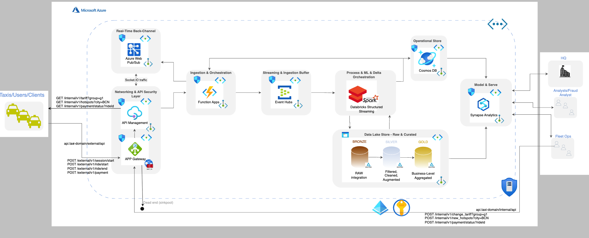

# 🚖 Taxi Service Architecture & Quick‑Start Guide



A **serverless, event‑driven data platform** that ingests taxi events, enriches them with dynamic tariffs & hot‑spots, and feeds analytics / AI pipelines in near real‑time.

---

## ✨ Stack Overview

| Layer / Domain      | Azure Service(s) | Purpose |
|---------------------|------------------|---------|
| **Ingress / Frontend** | **API Management** | Public façade, auth, rate‑limit, payload filtering |
| **Backend** | **Azure Function App** | Stateless API logic (`session/start`, `ride/*`, etc.) |
| **Stream Ingestion** | **Event Hub** (Standard, 1 PU) | Buffer & replay of ride events |
| **Operational DB** | **Cosmos DB (Serverless)** | Live ride/session state, fraud alerts, latest tariff & hotspot configs |
| **Long‑term Storage / Data Lake** | **Storage Account + Delta Lake (Bronze / Silver / Gold)** | Raw JSON → Parquet, historical reprocessing, cost‑efficient at scale |
| **Stream Processing** | **Databricks Structured Streaming** | Real‑time fraud detection, hotspot prediction, writes enriched data back to Cosmos & Delta Lake |
| **Realtime Push Backchannel** | **Web PubSub** | Sends hotspot/tariff updates and fraud notifications back to taxis |
| **Analytics / BI** | **Synapse Analytics (+ Power BI)** | Ad‑hoc SQL, dashboarding, enterprise reporting over Delta Lake Gold |


---

## ⚙️ Continuous Integration / Deployment (CI/CD)

### 📦 GitHub Actions Pipeline

This repository includes a GitHub Actions workflow that **tests and deploys** any code changes within `src/functions/**`.

```yaml
# .github/workflows/azure-function-deploy.yml
```
---
## 🚀 Deploying the Function App manually (DEV)


```bash
pip install -r src/requirements.txt

func azure functionapp publish {NAME-function-app} --verbose
```
---
## 🧪 Run Function App Locally

To run your Azure Function App locally for testing:

```bash
cd src/functions
func start
